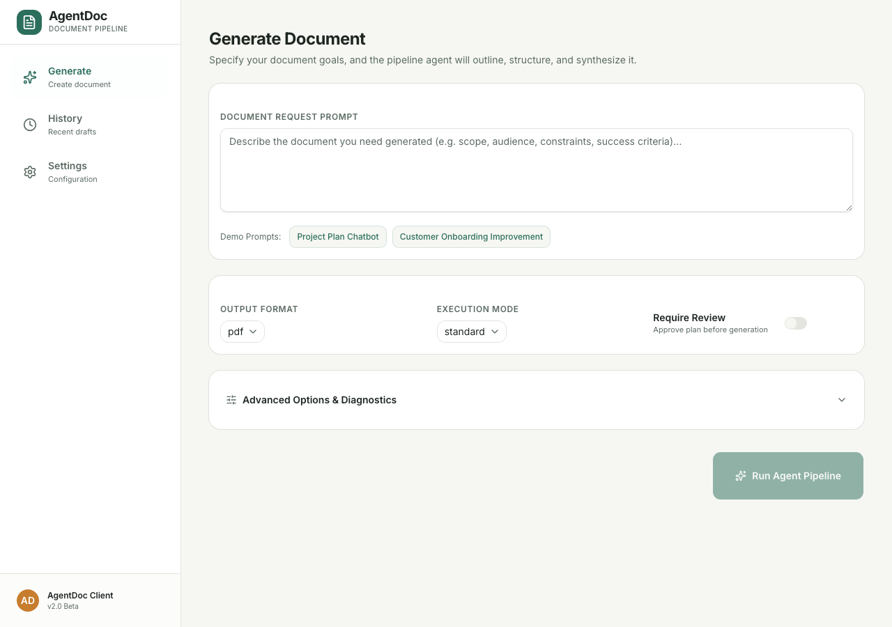
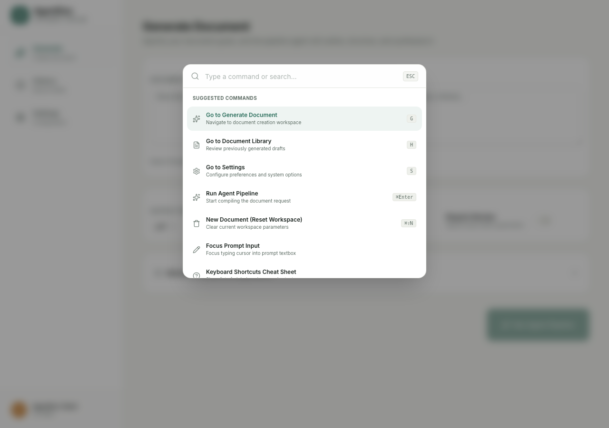

# AgentDoc — Autonomous AI Document Workspace

AgentDoc is an autonomous AI document generation workspace. It accepts natural-language prompts, drafts its own structured task plans, allows real-time interactive plan editing, executes targeted content synthesis, audits output quality via detailed self-check reflections, and exports editorial-grade PDFs.

---

## 🚀 Key Features

*   **Autonomous Planning**: Decomposes natural language requests into task checklists.
*   **Human-in-the-Loop Reviews**: Pause the pipeline to edit, add, delete, and reorder task steps inline before execution resumes.
*   **Explainability & Insights**: Inspect planner assumptions, confidence ratings, complexity classifications, and self-check reflection logs.
*   **Document Library**: Notion-style library cards with favorites pinning, document cloning, slide-out drawer details, and inline titles editing.
*   **Command Palette**: Global accessible Ctrl/Cmd + K bar supporting fuzzy searches and routing executions.
*   **Vellum & Ink Aesthetics**: Typography and spacing reminiscent of Notion, Claude, and Linear.
*   **Performance Optimization**: Dynamic route-based lazy loading and Rollup chunk splitting reduce index initial package size to under 20kB.

---

## 🏗️ System Architecture

```
                      [ Client UI React Workspace ]
                                    │
       ┌────────────────────────────┼────────────────────────────┐
       ▼ (Search / Star Favorites)   ▼ (Execute Commands)         ▼ (PDF / MD Downloads)
 [ Client IndexedDB ]          [ Commands Context Registry ] [ FastAPI Static Server ]
                                    │
                                    ▼ (Trigger Generation API POST)
                       [ FastAPI Request Router ]
                                    │
             ┌──────────────────────┴──────────────────────┐
             ▼ (Caches matching requests)                  ▼ (Bypasses / Cache Misses)
  [ SQLite Cache Store ]                      [ Multi-Agent Pipeline ]
                                                           │
        ┌──────────────┬──────────────┬──────────────┬─────┴────────┬──────────────┐
        ▼              ▼              ▼              ▼              ▼              ▼
   [ Classifier ] [ Planner ]   [ Plan Review ] [ Executor ]  [ Synthesizer ] [ Reflector ]
   (Resolves mode)(Drafts outline)(Pause / Edit)(Runs steps)   (Markdown build)(Score checks)
```

---

## 🛠️ Technology Stack

*   **Frontend**: React 19, TypeScript, Vite, React Router v7, Tailwind CSS, Lucide Icons, react-markdown, Base UI.
*   **Backend**: FastAPI, Pydantic, python-docx, fpdf2, python-dotenv, OpenAI SDK, SQLite requests cache.

---

## 💻 Visual Walkthrough & Workflows

### 1. Project Landing Page
A clean, full-screen introduction outlining capabilities and execution flows.



### 2. Document Library (History Workspace)
Notion-style document previews with filters, search, and duplication actions.


### 3. Command Palette (`Cmd+K`)
Keyboard-first search panel for navigation and rapid executions.



---

## 📑 Quick Start & References

*   **Setup & Local Installation**: Refer to the [Installation Guide](file:///Users/ishanbhattacharjee/Desktop/AgentDoc_Project/INSTALLATION.md).
*   **Production Deployment**: Refer to the [Deployment Guide](file:///Users/ishanbhattacharjee/Desktop/AgentDoc_Project/DEPLOYMENT.md).
*   **System Design & Internals**: Refer to the [Architecture Documentation](file:///Users/ishanbhattacharjee/Desktop/AgentDoc_Project/ARCHITECTURE.md).
*   **Demonstration Scripts**: Refer to the [Demo Playbook](file:///Users/ishanbhattacharjee/Desktop/AgentDoc_Project/docs/DEMO.md) for 2-minute, 5-minute, and 10-minute walkthrough guides.
*   **Changelog & Updates**: Refer to the [Changelog](file:///Users/ishanbhattacharjee/Desktop/AgentDoc_Project/CHANGELOG.md).
*   **License**: Licensed under the [MIT License](file:///Users/ishanbhattacharjee/Desktop/AgentDoc_Project/LICENSE).
