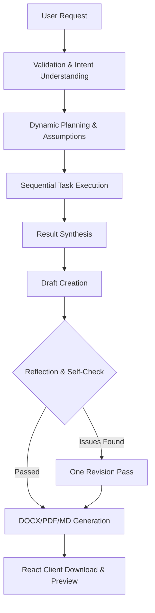

# AgentDoc – Autonomous Document Intelligence Platform

**AgentDoc – Autonomous Document Intelligence Platform** is a complete autonomous AI document-generation agent. It accepts a natural-language business request, understands the goal, creates its own dynamic task plan, executes the plan using controlled tools, synthesizes the results, performs a reflection/self-check, revises once if necessary, and generates a polished consulting-grade document.

This repository features the **Phase 1 Release Candidate (RC1)** representing a complete React + TypeScript + Tailwind CSS modern SPA migration of the frontend web client, fully integrated with the Python FastAPI backend.

---

## 🚀 Key Features

*   **Autonomous Dynamic Planning**: The LLM determines the goal, document type, complexity, confidence, assumptions, and task decomposition dynamically based on the input request.
*   **Human-in-the-Loop (Review Mode)**: Optionally pause the autonomous workflow after planning to edit, modify, and approve tasks before execution resumes.
*   **Controlled Tool Execution**: Maps LLM tasks to specific controlled internal tools (analysis, knowledge, requirements analysis, compliance, cost-benefit, priority matrix).
*   **Reflection & Quality Assessment**: Evaluates the generated draft against the original request and plan, returning professional grades. Performs exactly one revision pass if the grade is low, ensuring quality without infinite loops.
*   **Vellum & Ink Design Identity**: Clean, premium document-editorial workspace aesthetic using cool paper whites (`#F6F7F3`), deep graphite-green inks (`#1E2622`), and lab-teal primary accents (`#2C6E5C`).
*   **Real-Time SSE Streaming**: Supports server-sent events for step tracking (stepper showing active/done pipeline tasks) and token-by-token document synthesis.
*   **High Performance Throttled Rendering**: Employs `requestAnimationFrame` token buffering to prevent browser rendering thread locks during fast LLM output streams.

---

## 🏗️ Architecture

The document synthesis pipeline runs as follows:



### React Client Architecture & Component Hierarchy
The migrated frontend client uses modular components to separate state orchestration, network layer logic, and presentation:

```
frontend-react/src/
├── components/
│   ├── layout/
│   │   ├── AppShell/AppShell.tsx   # Persisted page layout wrapper
│   │   └── Sidebar/Sidebar.tsx     # Navigation sidebar (keyboard-accessible)
│   ├── document/
│   │   ├── PipelineStageBadge.tsx  # Dynamic stage status indicator
│   │   ├── StageTracker.tsx        # Horizontal stepper illustrating active step
│   │   ├── StreamingDocumentViewer.tsx # Markdown renderer (ReactMarkdown)
│   │   ├── StreamToolbar.tsx       # Standard cancel/reset controls
│   │   ├── GenerationSummary.tsx   # Vertical executive metrics summary card
│   │   └── TypingCursor.tsx        # Blinking cursor animation block
│   └── ui/                         # shadcn/ui custom primitives (cards, switches)
├── hooks/
│   └── useStreamingBuffer.ts       # requestAnimationFrame throttled rendering hook
├── services/
│   └── api.ts                      # Network layer (health check, GET/POST SSE streams)
├── types/
│   └── api.ts                      # Type-safe schemas and models
├── App.tsx                         # Router endpoints configuration
├── main.tsx                        # Entrypoint with BrowserRouter context
└── index.css                       # Design tokens and tailwind utilities
```

---

## 🛠️ Technology Stack

*   **Backend**: Python 3, FastAPI, Pydantic, python-docx, fpdf2, python-dotenv, OpenAI SDK.
*   **Frontend**: React 19, TypeScript, Vite, React Router v7, Tailwind CSS, Lucide React, react-markdown, Base UI (headless selectors & switches).

---

## 📦 Setup & Installation

### Prerequisite: Set up Backend environment

1.  **Clone the repository**:
    ```bash
    git clone https://github.com/ishanbhattacharjee12/AgentDoc.git
    cd AgentDoc
    ```

2.  **Initialize Python Virtual Environment**:
    ```bash
    python3 -m venv .venv
    source .venv/bin/activate
    pip install -r requirements.txt
    ```

3.  **Configure Environment Variables**:
    Create a `.env` file in the root directory:
    ```env
    LLM_PROVIDER=minimax
    LLM_API_KEY=your_api_key_here
    LLM_MODEL=minimax-text-01
    LLM_BASE_URL=https://api.minimax.chat/v1
    ENABLE_CACHE=true
    USE_DEMO_MODE=true
    ```

### Set up React Frontend

1.  **Navigate to frontend directory**:
    ```bash
    cd frontend-react
    ```

2.  **Install dependencies**:
    ```bash
    npm install
    ```

---

## 💻 Development Workflow

To run the application locally during development:

1.  **Start the Backend server** (from the root directory):
    ```bash
    source .venv/bin/activate
    PYTHONPATH=. uvicorn app.main:app --host 127.0.0.1 --port 8000
    ```

2.  **Start the Frontend dev server** (from the `frontend-react` directory):
    ```bash
    npm run dev
    ```
    Open **[http://localhost:5173/](http://localhost:5173/)** in your browser. The Vite proxy configuration automatically forwards API calls to `http://127.0.0.1:8000`.

### Build for Production
To compile and build the React app static client:
```bash
npm run build
```
This performs a typecheck and outputs optimized assets under `frontend-react/dist/`.

---

## 📑 Core Test Cases & Demos

You can test the generation workflow instantly using the preloaded demo buttons in the UI:

1.  **Standard Business Request (Chatbot Plan)**:
    *   *Prompt*: "Create a project plan for launching an AI-powered customer support chatbot..."
    *   *Result*: The agent recognizes the intent, forms assumptions, lists a 7-step plan, compiles details, and outputs a structured project plan with timelines, risks, and responsibilities.
2.  **Complex Ambiguous Request (Onboarding Plan)**:
    *   *Prompt*: "We need to improve customer onboarding because users are dropping off, but we don't know exactly where..."
    *   *Result*: The agent identifies key missing analytics, plans investigation steps first, respects capacity boundaries, and outputs a leaders-level 90-day plan.

---

## 🔒 Security & Safe Fallbacks

*   **Secret Safety**: API keys and environment `.env` files are git-ignored. Secret keys are never exposed in uvicorn logs or client-side responses.
*   **Path Traversal Checks**: Strict path validations protect the document download routes.
*   **Graceful Recovery**: Malformed plans received from LLM steps are programmatically repaired using recursive prompts or deterministic fallbacks.
