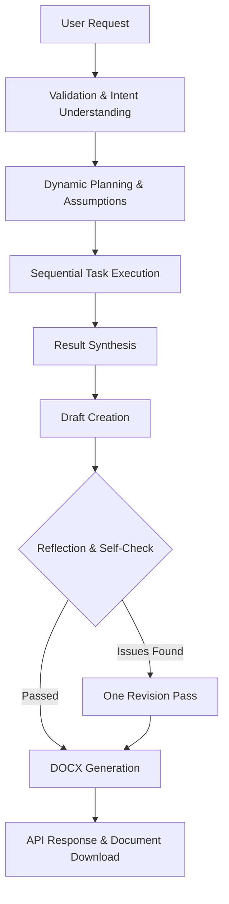

# AgentDoc – Autonomous Document Intelligence Platform

**AgentDoc – Autonomous Document Intelligence Platform** is a complete autonomous AI document-generation agent for a Python AI Engineer assignment. It accepts a natural-language business request, understands the goal, creates its own dynamic task plan, executes the plan using controlled tools, synthesizes the results, performs a reflection/self-check, revises once if necessary, and generates a polished Microsoft Word `.docx` document.

## Features

- **Autonomous Dynamic Planning**: The LLM determines the goal, document type, complexity, confidence, assumptions, and task decomposition (including tool routing) dynamically based on the input request.
- **Human-in-the-Loop (Review Mode)**: Optionally pause the autonomous workflow after planning to edit, modify, and approve tasks before execution resumes.
- **Controlled Tool Execution**: Maps LLM tasks to specific controlled internal tools (analysis, knowledge, requirements analysis, stakeholder analysis, compliance review, cost-benefit analysis, priority matrix).
- **Reflection & Quality Assessment**: Evaluates the generated draft against the original request and plan, returning professional grades (Excellent, Good, Satisfactory, Needs Revision, Poor). Performs exactly one revision pass if the grade is "Needs Revision" or "Poor", ensuring high quality without uncontrolled loops.
- **Multi-Format Export**: Generates professional documents from a single finalized representation. Supports `.docx`, `.pdf`, `.html`, and `.md` with consistent consultant-grade styling.
- **Modern SPA Frontend with Live SSE**: A flagship, portfolio-quality vanilla JS frontend that connects to `/agent/stream` via Server-Sent Events (SSE). It visualizes the agent's autonomous workflow in a live stepper and timeline, displaying execution metrics (Duration, LLM Calls, Tasks, Revisions), confidence, complexity, reading time, effort, and the planning summary.

## Architecture

The system follows a sequential orchestrated pipeline:



### Folder Structure

```
AgentDoc_Project/
├── app/
│   ├── main.py                # FastAPI application
│   ├── config.py              # Environment configuration
│   ├── models.py              # Pydantic schema validation
│   ├── agent/                 # Core agent logic
│   │   ├── orchestrator.py    # Main pipeline orchestrator
│   │   ├── planner.py         # Dynamic task planner
│   │   ├── executor.py        # Task executor and context manager
│   │   ├── synthesizer.py     # Document draft synthesis
│   │   └── reflector.py       # Reflection and revision logic
│   ├── llm/
│   │   └── client.py          # LLM API wrapper with retry logic
│   ├── tools/
│   │   ├── registry.py        # Tool allowlist
│   │   ├── analysis_tool.py   # Analytical reasoning tool
│   │   ├── knowledge_tool.py  # Domain knowledge tool
│   │   └── document_tool.py   # DOCX generation tool
│   ├── prompts/               # System and user prompts for LLM interactions
│   ├── static/                # Vanilla JS frontend
│   │   ├── index.html
│   │   ├── styles.css
│   │   └── app.js
│   └── outputs/               # Generated DOCX files (git-ignored)
├── requirements.txt
├── .env.example
├── .gitignore
└── README.md
```

## Technologies

- **Backend**: Python 3, FastAPI, Pydantic, python-docx, python-dotenv, OpenAI SDK (openai).
- **Frontend**: HTML5, CSS3, Vanilla JavaScript.

## Setup

1. **Clone the repository:**
   ```bash
   git clone https://github.com/ishanbhattacharjee12/AgentDoc.git
   cd AgentDoc
   ```

2. **Set up a virtual environment:**
   ```bash
   python3 -m venv .venv
   source .venv/bin/activate
   ```

3. **Install dependencies:**
   ```bash
   pip install -r requirements.txt
   ```

4. **Configure Environment Variables:**
   Copy the example config and edit it with your real LLM API key:

   ```bash
   cp .env.example .env
   # Edit .env
   LLM_PROVIDER=minimax
   LLM_API_KEY=your_api_key_here
   LLM_MODEL=minimax-text-01
   LLM_BASE_URL=https://api.minimax.chat/v1
   ```

## Running the Application

Start the FastAPI server via Uvicorn:
```bash
python3 -m uvicorn app.main:app --host 127.0.0.1 --port 8000
```

The application will be accessible at:
- **Frontend / UI**: [http://127.0.0.1:8000/](http://127.0.0.1:8000/)
- **API Docs**: [http://127.0.0.1:8000/docs](http://127.0.0.1:8000/docs)
- **Health Check**: [http://127.0.0.1:8000/health](http://127.0.0.1:8000/health)

## Usage

### Frontend Usage
Open [http://127.0.0.1:8000/](http://127.0.0.1:8000/) in your browser. You can enter a custom request, optionally enable "Review Plan Before Execution", choose the output format (DOCX, PDF, HTML, MD), or use the provided demo buttons.

### API Usage
You can run the agent pipeline via the `/agent` endpoint using `curl` or Postman.

```bash
curl -X POST http://127.0.0.1:8000/agent \
     -H "Content-Type: application/json" \
     -d '{"request": "Create a project plan...", "require_review": false, "format": "pdf"}'
```

Retrieve the generated document using the URL provided in the response:
```bash
curl -O http://127.0.0.1:8000/documents/agentdoc_project_plan_12345.pdf
```

## Required Test Cases

The application includes two primary test cases that demonstrate bounded autonomy:

1. **Standard Business Request**:
   *Request*: "Create a project plan for launching an AI-powered customer support chatbot for a mid-sized e-commerce company..."
   *Result*: The agent recognizes a project-plan intent, generates standard business assumptions, creates a 7-step plan, executes it, and generates a `.docx` project plan with phases, timelines, risks, and success metrics.

2. **Complex Ambiguous Request**:
   *Request*: "We need to improve customer onboarding because users are dropping off, but we don't know exactly where. Create a practical improvement plan that can be presented to leadership..."
   *Result*: The agent identifies the missing information and ambiguity, decides to investigate low-effort/high-return analytics first, builds a phased 90-day plan respecting constrained engineering capacity and budget, and outputs a leadership-ready improvement plan.

## Reflection and Self-Check

We implemented a **Reflection/Self-Check stage** because LLM-generated documents may appear structurally complete while still missing user requirements, lacking logical flow, or containing inconsistencies.

After the initial synthesis step, the Reflector evaluates the draft against the original request, the generated plan, and any explicit assumptions. If it finds missing actions, unclear priorities, or unfulfilled requests, it performs exactly **one controlled revision pass**. This improves output quality substantially while keeping latency and API usage tightly bounded (no uncontrolled loops).

### Debugging Insight: Rate Limits

During testing, complex multi-step generations can trigger HTTP 429 Too Many Requests errors if tasks run too quickly in parallel. The underlying LLM client catches these transient rate limit errors and applies a structured backoff-and-retry mechanism specifically for the LLM API (`openai.RateLimitError` handling), ensuring the full document can successfully generate without failing the entire pipeline.

## Error Recovery & Security

- **Path Traversal Protection**: The `/documents/{filename}` endpoint enforces strict checks to prevent unauthorized filesystem access (e.g., trying to read `../../.env`).
- **Secret Safety**: The `.env` file and `app/outputs/` directory are excluded via `.gitignore`. API keys are never exposed to the frontend or logs.
- **Graceful Fallbacks**: If the LLM generates malformed JSON for a plan, the client attempts to clean it, retries once with a repair prompt, and uses a deterministic fallback plan if it continues to fail.

## Engineering Tradeoff

**Autonomous Planning vs Deterministic Workflows**
AgentDoc allows the LLM to dynamically determine document type, assumptions, task decomposition, task order, and tool mapping. Fully unconstrained autonomy would reduce predictability and debuggability. Therefore, we used **bounded autonomy**: the LLM generates the plan, but it is validated via Pydantic schemas, routed to a controlled tool allowlist, protected by safe fallback behavior, and capped at one maximum reflection/revision pass before deterministic DOCX generation.

## Limitations and Future Improvements

- **External Integrations**: The Knowledge Tool is currently mocked/simulated and relies solely on the LLM's parametric knowledge. In the future, this could be extended to connect to internal company wikis or use RAG (Retrieval-Augmented Generation).
- **Scale and Durability**: Currently, the application uses an in-memory asyncio threadpool for agent execution. For production scale, it should ideally be converted to a distributed job queue (e.g., Celery) backed by Redis, with persistent storage of past generations in a database.
