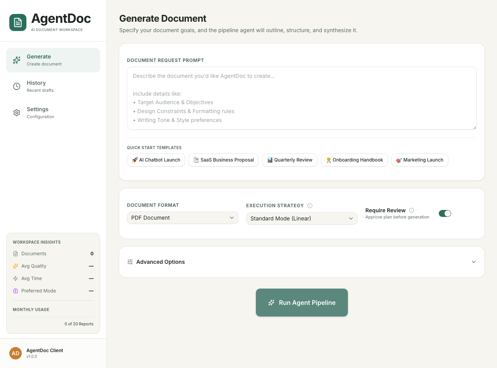
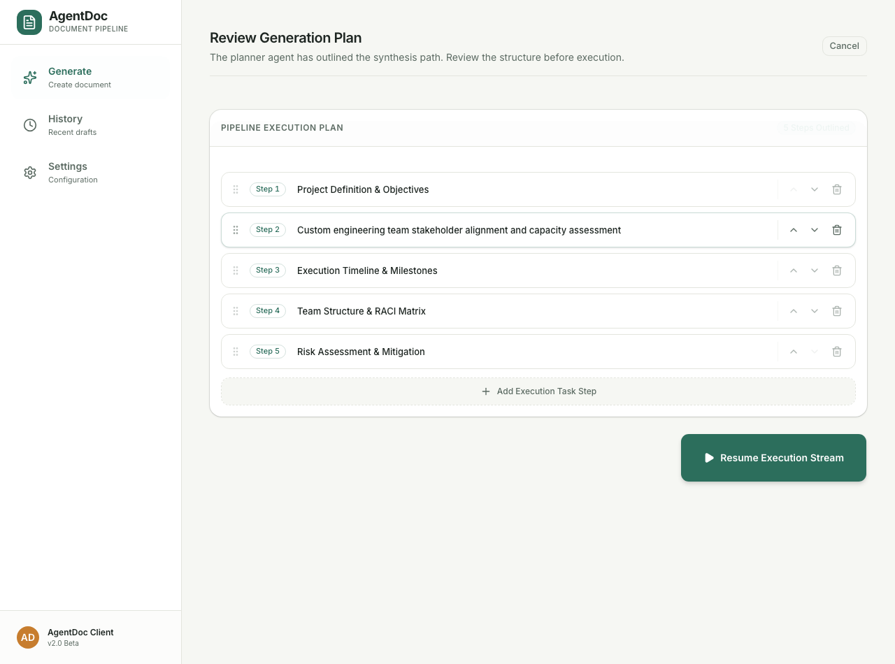
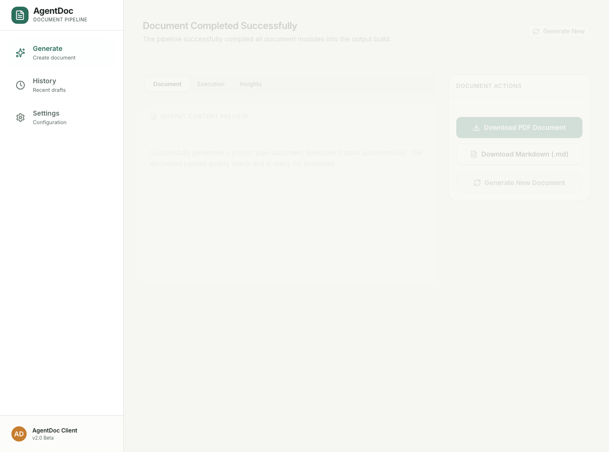
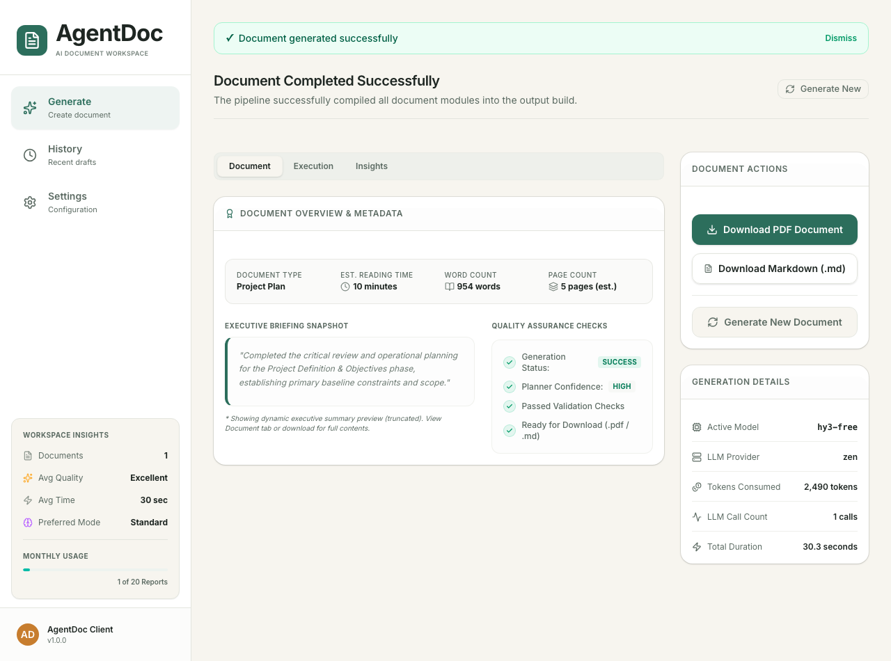
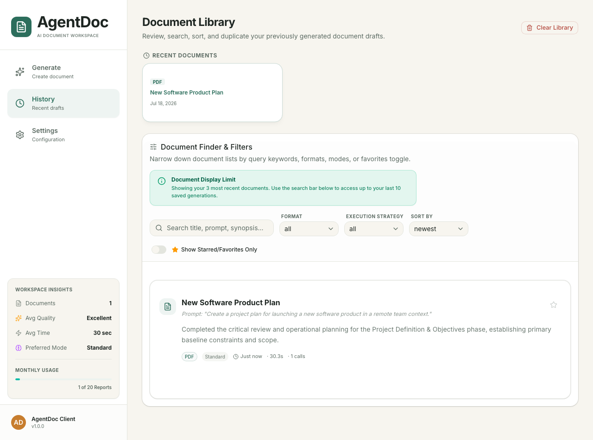

# AgentDoc — Autonomous AI Document Workspace

[](https://vite.dev/)
[](https://react.dev/)
[](https://fastapi.tiangolo.com/)
[](https://tailwindcss.com/)
[](https://www.python.org/)
[](https://opensource.org/licenses/MIT)

AgentDoc is an **autonomous document intelligence platform** that transforms natural-language prompts into publication-grade business reports, strategic plans, and technical architectures. Designed for consultants, analysts, and recruiters, it bridges the gap between raw LLM completions and executive-ready deliverables (PDF/DOCX/Markdown) through a multi-stage reasoning pipeline, real-time interactive plan editing, and a premium "vellum-and-ink" Notion-inspired workspace.

---

## 🚀 Key Features

*   **Autonomous Planning & Reasonings**: Decomposes complex user requests into structured, multi-phase execution tasks using an LLM-powered planner agent.
*   **Human-in-the-Loop Review Mode**: Pauses the generation pipeline, allowing users to inline edit, reorder, delete, or append tasks before the agent execution begins.
*   **Streaming Multi-Stage Execution**: Renders execution logs, generated tokens, and completed document sections in real time using Server-Sent Events (SSE).
*   **Glanceable Workspace Insights**: A responsive dashboard containing total document counts, average generation times, preferred generation modes, and monthly report usage tracking.
*   **Notion-Style History System**: Stored entirely client-side using IndexedDB with support for document favoriting, title renames, slide-out details preview drawers, and layout duplication.
*   **Fuzzy Command Palette (`Cmd+K`)**: Keyboard-first routing engine allowing fast navigation, document clearing, and template triggers.
*   **Consulting-Grade Document Exports**:
    *   **PDF**: Features custom typography (Inter), headers, margins, colored callouts, zebra-striped tables, page-break safeguards, and dynamic footer page numbering.
    *   **DOCX (Word)**: Visually matches the PDF styling with corporate-style cover pages, accent divider bars, custom table cells, and styled callout boxes.
    *   **Markdown**: Standard export of the raw, semantic source text.

---

## 🎨 Workspace Walkthrough

### 1. Document Creator Workspace
Enter natural language prompts, select standard or advanced modes, and toggle plan review safeguards.



### 2. Plan Review Editor (Review Mode)
Audit, edit, reorder, delete, or add tasks before the agent executes the generation stream.



### 3. Execution Live Streaming
Watch the synthesizer draft and format section contents phase by phase with live terminal logs.



### 4. Interactive Document Workspace
Inspect the completed consulting draft side-by-side with execution steps and metrics.



### 5. Document Library & Insights
Manage previous document drafts, favorite items, and review monthly quota metrics.



---

## 🏗️ System Architecture

```
                                [ Client UI React Workspace ]
                                              │
                 ┌────────────────────────────┼────────────────────────────┐
                 ▼ (Search / Star Favorites)   ▼ (Execute Commands)         ▼ (PDF / DOCX Downloads)
           [ Client IndexedDB ]          [ Commands Context Registry ] [ FastAPI Static Server ]
                                              │
                                              ▼ (Trigger Generation API POST)
                                 [ FastAPI Request Router ]
                                              │
                       ┌──────────────────────┴──────────────────────┐
                       ▼ (Caches matching requests)                  ▼ (Bypasses / Cache Misses)
            [ SQLite Cache Store ]                      [ Multi-Agent Pipeline ]
                                                                     │
                  ┌──────────────┬──────────────┬──────────────┬─────┴────────┬──────────────┐
                  ▼              ▼              ▼              ▼              ▼              ▼
             [ Classifier ] [ Planner ]   [ Plan Review ] [ Executor ]  [ Synthesizer ] [ Reflector ]
             (Resolves mode)(Drafts outline)(Pause / Edit)(Runs tasks)  (Markdown build)(Score checks)
```

1.  **Classifier**: Scans the input prompt to classify the document type (e.g. Project Plan, SOP, Proposal) and determines the appropriate execution path.
2.  **Planner**: Outlines the logical structure and tasks required to generate the requested document.
3.  **Plan Review**: Pauses the system if "Require Review" is toggled, exposing the plan nodes to the client UI for editing.
4.  **Executor**: Runs individual tasks sequentially, compiling contextual information.
5.  **Synthesizer**: Merges the gathered intelligence into a cohesive, beautifully formatted Markdown file.
6.  **Reflector**: Conducts a self-check evaluation and triggers exactly one revision pass if quality benchmarks are not met.
7.  **Document Exports**: Renders the final output dynamically into PDF, DOCX, and raw Markdown formats.

---

## 🛠️ Technology Stack

| Layer | Technologies |
|---|---|
| **Frontend** | React 19, TypeScript, Vite, React Router v7, Tailwind CSS, Base UI, Lucide Icons, react-markdown |
| **Backend** | Python 3.13, FastAPI, Uvicorn, Pydantic, SQLite (Request Cache) |
| **Document Export** | `fpdf2` (PDF Generation), `python-docx` (DOCX Templating), `markdown` |
| **AI Models** | OpenAI GPT-4o, Tencent OpenCode Zen (hy3-free) |
| **Development** | Playwright (E2E testing), Oxlint (Linting), Pytest |

---

## ⚙️ Configuration & Environment

Create a `.env` file in the project root containing:

```env
# Server Port (Default: 8000)
PORT=8000

# LLM Providers Configuration
OPENAI_API_KEY=your_openai_key_here
GEMINI_API_KEY=your_gemini_key_here

# Optional: Run in Demo Mode (Generates mock documents without API charges)
USE_DEMO_MODE=false
```

---

## 🚀 Installation & Setup

### Prerequisites
*   Node.js 20+
*   Python 3.11+
*   NPM or Yarn

### 1. Clone & Setup Backend
```bash
# Clone the repository
git clone https://github.com/ishanbhattacharjee12/AgentDoc.git
cd AgentDoc

# Create a virtual environment and install dependencies
python3 -m venv .venv
source .venv/bin/activate
pip install -r requirements.txt
```

### 2. Start the Backend Server
```bash
# From the project root (venv active)
python -m uvicorn app.main:app --reload --port 8000
```

### 3. Setup & Start the Frontend
```bash
# Open a new terminal tab/window
cd frontend-react
npm install
npm run dev
```
Open `http://localhost:5173` in your browser to run the application.

---

## 📁 Repository Folder Structure

```text
.
├── ARCHITECTURE.md          # Detailed engineering & design specifications
├── DEPLOYMENT.md            # Production deployment guidelines
├── INSTALLATION.md          # Developer environment setup
├── CHANGELOG.md             # Changelog and version release notes
├── app
│   ├── agent                # Multi-agent pipelines (Planner, Synthesizer, Reflector)
│   ├── llm                  # LLM Client wrappers, rate-limiting, and budget guards
│   ├── main.py              # FastAPI server router & endpoints
│   ├── static               # Static bundle fallback files
│   └── tools                # PDF & DOCX rendering tools
├── docs
│   ├── DEMO.md              # 2-minute, 5-minute, and 10-minute audit scripts
│   ├── examples             # Consulting document exports (PDF / DOCX examples)
│   └── roadmaps             # Historical roadmaps and architectural specs
├── frontend-react
│   ├── src                  # React views, hooks, components, and layout shells
│   └── package.json         # React client dependencies
├── scratch                  # Local regressions, tests, and screenshot scripts
└── tests                    # Backend unit test suites
```

---

## 📄 License
Licensed under the [MIT License](LICENSE).

---

## ✍️ Author
Developed by **Ishan Bhattacharjee** (ishanbhattacharjee12).
